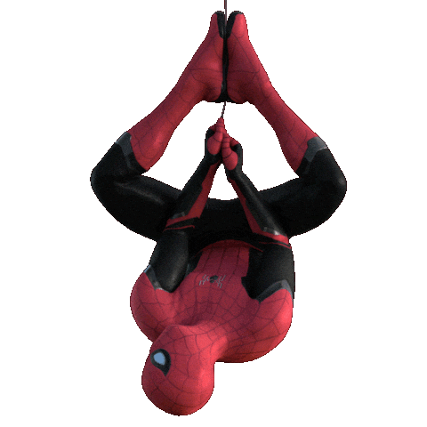
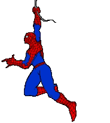

<div align="center">




<a href="https://github.com/kunal20-sus">
  
</a>

</div>

---

### 🕷️ About Me

```yaml
name: Kunal Kumar
role: B.Tech CSE Student @ SRMIST Kattakulathur, Chennai
batch: 2025 - 2029
origin: Samastipur, Bihar
alter_ego: Class Representative, NSO Member & Aspiring Consultant
```

<table>
  <tr>
    <td width="75%" valign="top">
      <ul>
        <li>🎓 B.Tech CSE student at <b>SRMIST Kattakulathur</b>, Chennai</li>
        <li>🏛️ Serving as <b>Class Representative</b> and <b>NSO member</b> on campus</li>
        <li>📊 Business Analyst track member at <b>180 Degrees Consulting, SRM IST KTR</b></li>
        <li>🤝 Member of <b>Cintel Association</b> (Corporate domain)</li>
        <li>🛠️ Volunteer with <b>DSA SRMIST</b> (Discipline domain) & <b>SRM Alumni Affairs</b> (Sponsorship/PR)</li>
        <li>🌱 Currently sharpening DSA, development skills, and consulting fundamentals</li>
        <li>⚡ Fun fact: every <code>git push</code> feels like swinging between skyscrapers</li>
      </ul>
    </td>
    <td width="25%" align="center" valign="middle">
      
    </td>
  </tr>
</table>

---

### 🧰 Tech Web

<div align="center">


</div>

---

### 📊 Stats from the Web

<div align="center">


</div>

---

<!-- Note: github-profile-trophy is currently disabled on Vercel upstream; uncomment if service returns
### 🕸️ GitHub Trophies

<div align="center">


</div>

---
-->

### 🌆 Connect With Me

<div align="center">

<a href="https://linkedin.com/in/kunal-kumar-76b078267"></a>
<a href="mailto:kunallynx20@gmail.com"></a>

</div>

---

<div align="center">


*"It's not about being perfect. It's about making a difference — one commit at a time."*


</div>
